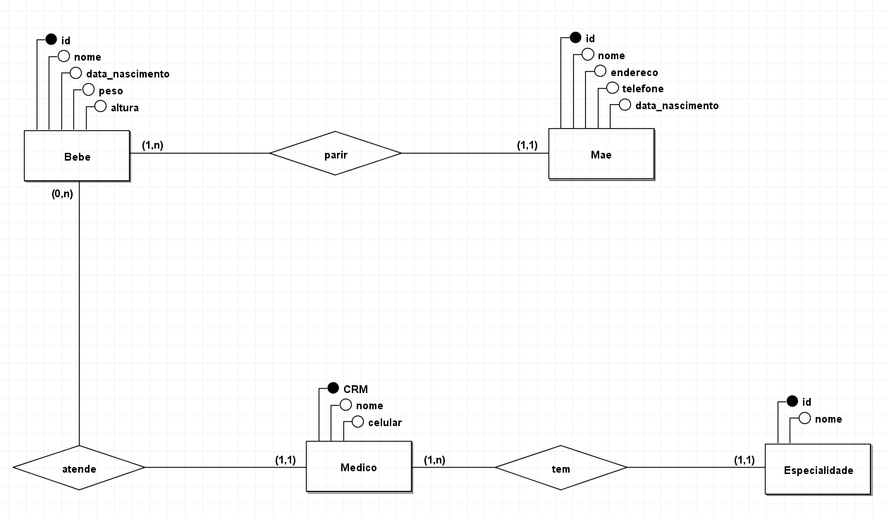

# Modelagem de um berçario para informatizar suas operações

## Regra de negócio / Requisitos

Um berçário deseja informatizar suas operações. Quando um bebê
nasce, algumas informações são armazenadas sobre ele, tais como:
nome, data do nascimento, peso do nascimento, altura, a mãe deste
bebê e o médico que fez seu parto. Para as mães, o berçário também
deseja manter um controle, guardando informações como: nome,
endereço, telefone e data de nascimento. Para os médicos, é importante
saber: CRM, nome, telefone celular e especialidade.

## Modelo conceitual DER (1.0)

## Modelo conceitual (DER 1.1)

Incluindo cardinalidade pertinentes a regra de negócio de forma a atender os requisitos do sistema e tendo como objetivo atender o mundo real.

## Modelo conceitual DER (1.2)

Desvendando relacionamentos n:n (muitos-para-muitos) para evitar anomalias futuras.

[voltar](../../Readme.md)