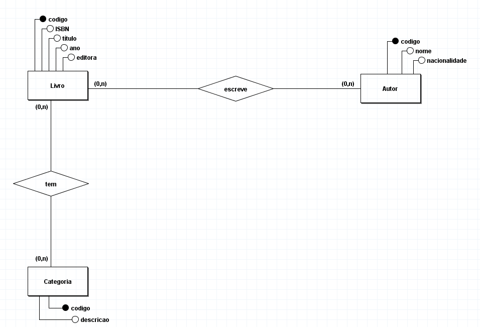
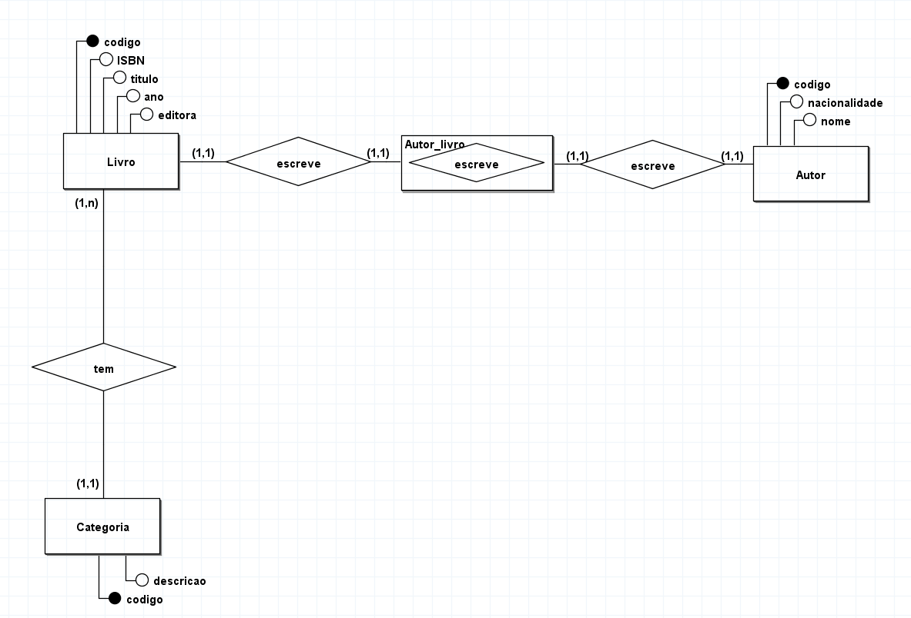

# Modelagem de uma biblioteca para manter informações sobre livros

## Regra de negócio / Requisitos

Uma biblioteca deseja manter informações sobre seus livros.
Inicialmente, quer armazenar para os livros as seguintes características:
ISBN, título, ano editora e autores deste livro. Para os autores, deseja
manter: nome e nacionalidade. Cabe salientar que um autor pode ter
vários livros, assim como um livro pode ser escrito por vários autores.
Cada livro da biblioteca pertence a uma categoria. A biblioteca deseja
manter um cadastro de todas as categorias existentes, com informações
como: código da categoria e descrição. Uma categoria pode ter vários
livros associados a ela.

## Modelo conceitual DER (1.0)

## Modelo conceitual (DER 1.1)

Incluindo cardinalidade pertinentes a regra de negócio de forma a atender os requisitos do sistema e tendo como objetivo atender o mundo real.

 

## Modelo conceitual (DER 1.2)

Desvendando relacionamentos n:n (muitos-para-muitos) para evitar anomalias futuras.

[voltar](../../Readme.md)