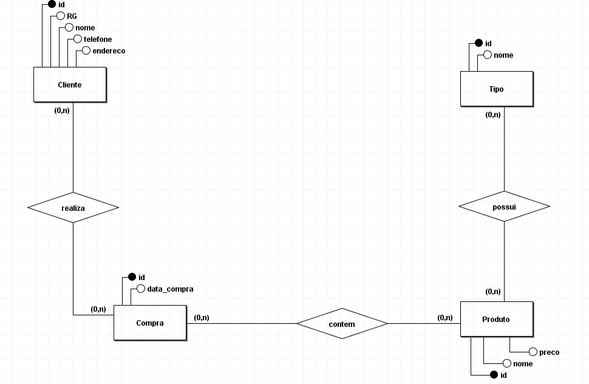
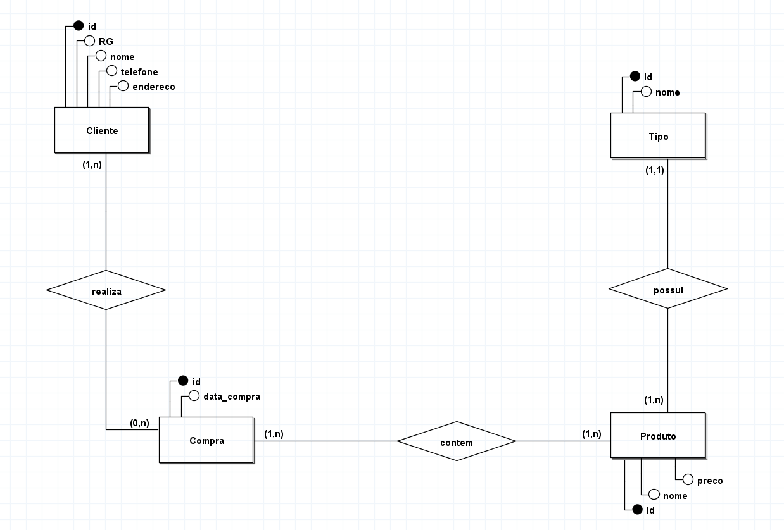
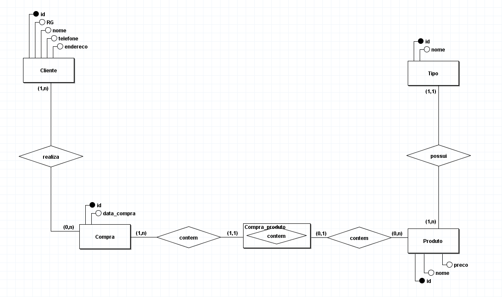

# Modelagem de uma floricultura para informatizar operações

## Regra de negócio / Requisitos

Uma floricultura deseja informatizar suas operações. Inicialmente,
deseja manter um cadastro de todos os seus clientes, mantendo
informações como: RG, nome, telefone e endereço. Deseja também
manter um cadastro contendo informações sobre os produtos que
vende, tais como: nome do produto, tipo (flor, vaso, planta,...), preço e
quantidade em estoque. Quando um cliente faz uma compra, a mesma é
armazenada, mantendo informação sobre o cliente que fez a compra, a
data da compra, o valor total e os produtos comprados.

## Modelo conceitual (DER 1.0)

## Modelo conceitual (DER 1.1)

Incluindo cardinalidade pertinentes a regra de negócio de forma a atender os requisitos do sistema e tendo como objetivo atender o mundo real.

## Modelo conceitual (DER 1.2)

Desvendando relacionamentos n:n (muitos-para-muitos) para evitar anomalias futuras.

[voltar](../../Readme.md)